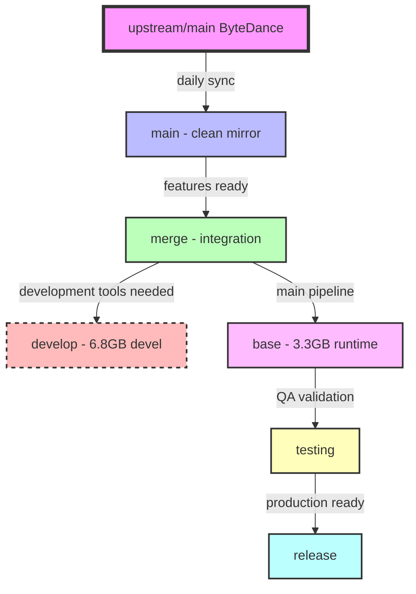

# Branch Flow and Management

## Visual Branch Hierarchy



## Branch Flow Rules

### Upstream Synchronization
```
ByteDance → main (daily)
main → merge (after testing)
```

### Feature Development
```
feature-branch → merge
bug-fix-branch → merge
test-branch → merge
```

### Release Pipeline (Primary)
```
merge → base → testing → release
```

### Development Pipeline (Secondary)
```
merge → develop (sibling to base)
```

## Quick Reference Commands

### 1. Daily Upstream Sync
```bash
# Every morning, sync with ByteDance
git checkout main
git fetch upstream
git merge upstream/main --ff-only
git push origin main

# Update merge branch
git checkout merge
git merge main
git push origin merge
```

### 2. Feature Development
```bash
# Start new feature
git checkout merge
git pull origin merge
git checkout -b shadnygren/feature-xyz

# After development
git checkout merge
git merge shadnygren/feature-xyz
git push origin merge
```

### 3. Upstream Contribution
```bash
# Create clean PR branch
git checkout main
git checkout -b shadnygren/fix-issue-123

# Cherry-pick specific commits
git cherry-pick <commit-hash>

# Push and create PR
git push origin shadnygren/fix-issue-123
# Create PR from main → upstream/main within 48 hours
```

### 4. Release Promotion
```bash
# Promote to base (runtime image)
git checkout base
git merge merge
git push origin base
# Wait for Docker build

# Promote to testing
git checkout testing
git merge base
git push origin testing
# Run full test suite

# Promote to release
git checkout release
git merge testing
git tag v1.0.0
git push origin release --tags
```

### 5. Development Branch Update
```bash
# Update development branch (not in release pipeline)
git checkout develop
git merge merge
git push origin develop
# Docker build with development tools
```

## Branch Protection Rules

### `main`
- **No direct pushes** (except sync from upstream)
- **No PRs** (clean mirror only)
- **Auto-sync**: Daily from upstream/main

### `merge`
- **Require PR reviews** for external contributors
- **Run tests** before merge
- **No force push**

### `base`, `testing`, `release`
- **Protected branches**
- **Require successful builds**
- **Require passing tests**
- **Tagged releases only** for `release`

## Docker Image Mapping

| Branch | Docker Base | Size | Image Tag |
|--------|------------|------|-----------|
| develop | pytorch/pytorch:2.7.1-cuda12.6-cudnn9-devel | 6.8GB | ghcr.io/shadnygren/protenix:develop |
| base | pytorch/pytorch:2.7.1-cuda12.6-cudnn9-runtime | 3.3GB | ghcr.io/shadnygren/protenix:base |
| testing | (inherits from base) | 3.3GB | ghcr.io/shadnygren/protenix:testing |
| release | (inherits from base) | 3.3GB | ghcr.io/shadnygren/protenix:release |

## Feature Branch Naming

### Convention
`shadnygren/[type]-[description]`

### Types
- `feature-` New functionality
- `fix-issue-` Bug fixes (with issue number)
- `test-` Test additions
- `docs-` Documentation only
- `docker-` Docker/deployment changes
- `perf-` Performance improvements

### Examples
- `shadnygren/fix-issue-185`
- `shadnygren/feature-mini-model`
- `shadnygren/test-coverage`
- `shadnygren/docker-pytorch-base`

## Merge Checklist

### Before Merging to `merge`
- [ ] Tests pass locally
- [ ] No merge conflicts with main
- [ ] Documentation updated if needed
- [ ] Follows coding standards

### Before Merging to `base`
- [ ] All tests pass in merge branch
- [ ] Docker builds successfully
- [ ] No upstream conflicts
- [ ] Performance benchmarks acceptable

### Before Merging to `testing`
- [ ] Docker image builds and runs
- [ ] Integration tests pass
- [ ] No regression in accuracy
- [ ] Resource usage acceptable

### Before Merging to `release`
- [ ] Full QA cycle complete
- [ ] Performance validated
- [ ] Documentation complete
- [ ] Version tagged appropriately

## Emergency Procedures

### Upstream Breaking Change
```bash
# Create hotfix branch
git checkout main
git checkout -b hotfix/upstream-break

# Fix and test
# ...

# Fast-track to merge
git checkout merge
git merge hotfix/upstream-break

# Propagate through pipeline quickly
```

### Rollback Release
```bash
git checkout release
git revert HEAD
git tag v1.0.1-rollback
git push origin release --tags
```

## Notes

- **Never submit internal docs** (STRATEGY.md, BRANCH-FLOW.md, etc.) to upstream
- **48-hour rule**: Submit PRs to ByteDance within 48 hours
- **Keep PRs small**: <500 lines for upstream contributions
- **Test everything**: Every merge should be tested
- **Document changes**: Update CHANGELOG.md for significant changes

---

*This document is for internal use only and should never be included in upstream PRs.*