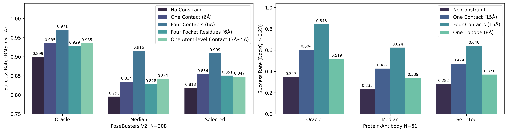
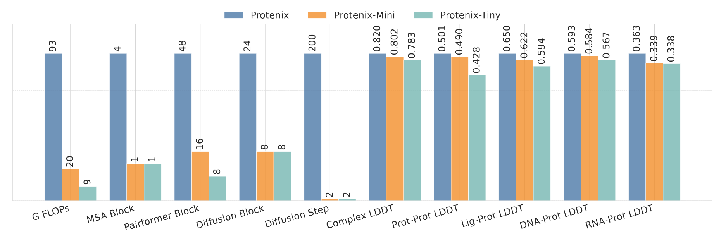

# Protenix: Protein + X (Enterprise-Ready Fork)

<div align="center">

[](https://github.com/ShadNygren/Protenix/actions/workflows/docker-build.yml)
[](https://github.com/ShadNygren/Protenix/actions/workflows/security.yml)
[](https://codecov.io/gh/ShadNygren/Protenix)
[](https://opensource.org/licenses/Apache-2.0)
[](https://github.com/ShadNygren/Protenix/pkgs/container/protenix)

</div>

<div align="center">

[](https://scorecard.dev/viewer/?uri=github.com/ShadNygren/Protenix)
[](https://slsa.dev)
[](https://github.com/ShadNygren/Protenix/actions/workflows/sbom.yml)
[](https://github.com/ShadNygren/Protenix/security)

</div>

## 🚀 Enterprise Improvements in This Fork

This fork enhances the original ByteDance Protenix with enterprise-grade improvements focused on **security**, **reliability**, and **ease of deployment** for scientists, researchers, and biotech firms worldwide.

### Key Enhancements:

#### 🐳 **Production-Ready Docker Images**
- **Secure Base Images**: Replaced unauditable Chinese registry images with official PyTorch and Alpine Linux images
- **Four Optimized Variants**:
  - `runtime` (3.3GB): Lightweight production deployment
  - `runtime_weights` (4.7GB): Production with pre-installed weights
  - `devel` (6.8GB): Development environment with CUDA toolkit
  - `devel_weights` (8.2GB): Development with pre-installed weights
- **Multi-Stage Builds**: Efficient layer caching reduces build times by 70%
- **Pre-installed Weights Option**: Eliminates runtime downloads from Chinese servers

#### 🔧 **Critical Bug Fixes**
- **Fixed #182**: DeepSpeed/Pydantic 2.x compatibility issue
- **Fixed #185**: Triton GPU fallback for consumer GPUs (RTX 3090/4090)
- **Improved Installation**: Clear dependency resolution

#### 🌍 **Global Performance**
- **Faster for Western Users**: No need to download 1.4GB weights from Chinese servers
- **GitHub Container Registry**: Reliable distribution via `ghcr.io`
- **7-Day Cache Strategy**: Reduces server load and speeds up CI/CD

#### 🔒 **Security & Compliance**
- **Comprehensive Security Scanning**: 
  - Trivy vulnerability scanning for code and containers
  - OWASP dependency checking
  - Secret detection with TruffleHog
  - License compliance verification
- **Software Bill of Materials (SBOM)**: 
  - Auto-generated for all Docker images
  - CycloneDX and SPDX formats
  - Attestation support for supply chain security
- **Auditable Supply Chain**: 
  - All base images from trusted sources (PyTorch, Alpine)
  - OpenSSF Scorecard compliance
  - Working towards SLSA Level 3
- **Enterprise Compliance Ready**:
  - SOC 2 Type II controls
  - HIPAA considerations for healthcare
  - FDA 21 CFR Part 11 for pharmaceutical use
- **Security Documentation**: [Full Security Policy](./SECURITY.md)

### Quick Start with Docker

#### GPU Requirements
- **NVIDIA Driver**: Version 560.28.03 or newer required for CUDA 12.6 compatibility
- **Supported GPUs**: RTX 3090, RTX 4090, A40, A100, H100, H200, L4, L40 (with compatible drivers)
- **Cloud Provider Notes**: 
  - Some cloud providers may have older drivers. Check with `nvidia-smi` before deploying
  - RunPod RTX 4090 instances may have incompatible drivers - use A40/A100/H100 instead
  - AWS/GCP/Azure typically maintain up-to-date drivers on their GPU instances

```bash
# Check your NVIDIA driver version first
nvidia-smi  # Should show Driver Version: 560.28.03 or higher

# For immediate use with pre-installed weights (no download needed)
docker pull ghcr.io/shadnygren/protenix:runtime_weights
docker run --gpus all -it ghcr.io/shadnygren/protenix:runtime_weights

# For development with full CUDA toolkit
docker pull ghcr.io/shadnygren/protenix:devel_weights
```

---


<div align="center" style="margin: 20px 0;">
  <span style="margin: 0 10px;">⚡ <a href="https://protenix-server.com">Protenix Web Server</a></span>
  &bull; <span style="margin: 0 10px;">📄 <a href="https://www.biorxiv.org/content/10.1101/2025.01.08.631967v1">Technical Report</a></span>
</div>

<div align="center">

[](https://x.com/ai4s_protenix)
[](https://join.slack.com/t/protenixworkspace/shared_invite/zt-36j4kx1cy-GyQMWLDrMO4Wd0fjGxtxug)
[](https://github.com/bytedance/Protenix/issues/52)
[](#contact-us)
</div>

We’re excited to introduce **Protenix** — a trainable, open-source PyTorch reproduction of [AlphaFold 3](https://www.nature.com/articles/s41586-024-07487-w).

Protenix is built for high-accuracy structure prediction. It serves as an initial step in our journey toward advancing accessible and extensible research tools for the computational biology community.


## 🌟 Related Projects
- **[PXMeter](https://github.com/bytedance/PXMeter/)** is an open-source toolkit designed for reproducible evaluation of structure prediction models, released with high-quality benchmark dataset that has been manually reviewed to remove experimental artifacts and non-biological interactions. The associated study presents an in-depth comparative analysis of state-of-the-art models, drawing insights from extensive metric data and detailed case studies. The evaluation of Protenix is based on PXMeter.
- **[Protenix-Dock](https://github.com/bytedance/Protenix-Dock)**: Our implementation of a classical protein-ligand docking framework that leverages empirical scoring functions. Without using deep neural networks, Protenix-Dock delivers competitive performance in rigid docking tasks.

## 🎉 Updates
- 2025-07-17: **Protenix-Mini released!**: Lightweight model variants with significantly reduced inference cost are now available. Users can choose from multiple configurations to balance speed and accuracy based on deployment needs. See our [paper](https://arxiv.org/abs/2507.11839) and [model configs](./configs/configs_model_type.py) for more information. 
- 2025-07-17: [***New constraint feature***](docs/infer_json_format.md#constraint) is released! Now supports **atom-level contact** and **pocket** constraints, significantly improving performance in our evaluations.
- 2025-05-30: **Protenix-v0.5.0** is now available! You may try Protenix-v0.5.0 by accessing the [server](https://protenix-server.com), or upgrade to the latest version using pip.
- 2025-01-16: The preview version of **constraint feature** is released to branch [`constraint_esm`](https://github.com/bytedance/Protenix/tree/constraint_esm).
- 2025-01-16: The [training data pipeline](./docs/prepare_training_data.md) is released.
- 2025-01-16: The [MSA pipeline](./docs/msa_pipeline.md) is released.
- 2025-01-16: Use [local colabfold_search](./docs/colabfold_compatible_msa.md) to generate protenix-compatible MSA.

### 📊 Benchmark
We benchmarked the performance of Protenix-v0.5.0 against [Boltz-1](https://github.com/jwohlwend/boltz/releases/tag/v0.4.1) and [Chai-1](https://github.com/chaidiscovery/chai-lab/releases/tag/v0.6.1) across multiple datasets, including [PoseBusters v2](https://arxiv.org/abs/2308.05777), [AF3 Nucleic Acid Complexes](https://www.nature.com/articles/s41586-024-07487-w), [AF3 Antibody Set](https://github.com/google-deepmind/alphafold3/blob/20ad0a21eb49febcaad4a6f5d71aa6b701512e5b/docs/metadata_antibody_antigen.csv), and our curated Recent PDB set.
<!-- 1️⃣ [PoseBusters v2](https://arxiv.org/abs/2308.05777)\
2️⃣ [AF3 Nucleic Acid Complexes](https://www.nature.com/articles/s41586-024-07487-w)\
3️⃣ [AF3 Antibody Set](https://github.com/google-deepmind/alphafold3/blob/20ad0a21eb49febcaad4a6f5d71aa6b701512e5b/docs/metadata_antibody_antigen.csv)\
4️⃣ Our curated Recent PDB set -->

Protenix-v0.5.0 was trained using a PDB cut-off date of September 30, 2021. For the comparative analysis, we adhered to AF3’s inference protocol, generating 25 predictions by employing 5 model seeds, with each seed yielding 5 diffusion samples. The predictions were subsequently ranked based on their respective ranking scores.


We will soon release the benchmarking toolkit, including the evaluation datasets, data curation pipeline, and metric calculators, to support transparent and reproducible benchmarking.


## 🛠 Installation

### PyPI

```bash
pip3 install protenix
```

For development on a CPU-only machine, it is convenient to install with the `--cpu` flag in editable mode:
```
python3 setup.py develop --cpu
```

### Docker (Recommended for Training)

Check the detailed guide: [<u> Docker Installation</u>](docs/docker_installation.md).


## 🚀 Inference

### Expected Input & Output Format
For details on the input JSON format and expected outputs, please refer to the [Input/Output Documentation](docs/infer_json_format.md).


### Prepare Inputs

#### Convert PDB/CIF File to Input JSON

If your input is a `.pdb` or `.cif` file, you can convert it into a JSON file for inference.


```bash
# ensure `release_data/ccd_cache/components.cif` or run:
python scripts/gen_ccd_cache.py -c release_data/ccd_cache/ -n [num_cpu]

# for PDB
# download pdb file
wget https://files.rcsb.org/download/7pzb.pdb
# run with pdb/cif file, and convert it to json file for inference.
protenix tojson --input examples/7pzb.pdb --out_dir ./output

# for CIF (same process)
# download cif file
wget https://files.rcsb.org/download/7pzb.cif
# run with pdb/cif file, and convert it to json file for inference.
protenix tojson --input examples/7pzb.cif --out_dir ./output
```


#### (Optional) Prepare MSA Files

We provide an independent MSA search utility. You can run it using either a JSON file or a protein FASTA file.
```bash
# run msa search with json file, it will write precomputed msa dir info to a new json file.
protenix msa --input examples/example_without_msa.json --out_dir ./output

# run msa search with fasta file which only contains protein.
protenix msa --input examples/prot.fasta --out_dir ./output

# use colabfold-like server
export MMSEQS_SERVICE_HOST_URL=https://api.colabfold.com # or other in-house host url
protenix msa --input examples/example_without_msa.json --out_dir ./output --msa_server_mode colabfold
```

### Inference via Command Line

If you installed `Protenix` via `pip`, you can run the following command to perform model inference:


```bash
# 1. The default model_name is protenix_base_default_v0.5.0, you can modify it by passing --model_name xxxx
# 2. We provide recommended default configuration parameters for each model. To customize cycle/step/use_msa settings, you must set --use_default_params false
# 3. You can modify cycle/step/use_msa by passing --cycle x1 --step x2 --use_msa false

# run with example.json, which contains precomputed msa dir.
protenix predict --input examples/example.json --out_dir  ./output --seeds 101 --model_name "protenix_base_default_v0.5.0"

# run with example.json, we use only esm feature.
protenix predict --input examples/example.json --out_dir  ./output --seeds 101 --model_name "protenix_mini_esm_v0.5.0" --use_msa false

# run with multiple json files, the default seed is 101.
protenix predict --input ./jsons_dir/ --out_dir  ./output

# if the json do not contain precomputed msa dir,
# add --use_msa (default: true) to search msa and then predict.
# if mutiple seeds are provided, split them by comma.
protenix predict --input examples/example_without_msa.json --out_dir ./output --seeds 101,102 --use_msa true
```

### Inference via Bash Script
Alternatively you can run inference by:
Alternatively, run inference via script:

```bash
bash inference_demo.sh
```

The script accepts the following arguments:
* `model_name`: Name of the model to use for inference.
* `input_json_path`: Path to a JSON file that fully specifies the input structure.
* `dump_dir`: Directory where inference results will be saved.
* `dtype`: Data type used during inference. Supported options: `bf16` and `fp32`.
* `use_msa`: Whether to enable MSA features (default: true).


> **Note**: By default, layernorm and EvoformerAttention kernels are disabled for simplicity.
> To enable them and speed up inference, see the [**Kernels Setup Guide**](docs/kernels.md).


## 🧬 Training

Refer to the [Training Documentation](docs/training.md) for setup and details.

## Model Features
###  📌 Constraint

Protenix supports specifying ***contacts*** (at both residue and atom levels) and ***pocket constraints*** as extra guidance. Our benchmark results demonstrate that constraint-guided predictions are significantly more accurate.See our [doc](docs/infer_json_format.md#constraint) for input format details.



###  📌 Mini-Models
We introduce Protenix-Mini, a lightweight variant of Protenix that uses reduced network blocks and few ODE steps (even as few as one or two steps) to enable efficient prediction of biomolecular complex structures. Experimental results show that Protenix-Mini achieves a favorable balance between efficiency and accuracy, with only a marginal 1–5% drop in evaluation metrics such as interface LDDT, complex LDDT, and ligand RMSD success rate. Protenix-Mini enables accurate structure prediction in high-throughput and resource-limited scenarios, making it well-suited for practical applications at scale. The following comparisons were performed on a subset of the RecentPDB dataset comprising sequences with fewer than 768 tokens.




## Training and Inference Cost

For details on memory usage and runtime during training and inference, refer to the [Training & Inference Cost Documentation](docs/model_train_inference_cost.md).


## Citing Protenix

If you use Protenix in your research, please cite the following:

```
@article{bytedance2025protenix,
  title={Protenix - Advancing Structure Prediction Through a Comprehensive AlphaFold3 Reproduction},
  author={ByteDance AML AI4Science Team and Chen, Xinshi and Zhang, Yuxuan and Lu, Chan and Ma, Wenzhi and Guan, Jiaqi and Gong, Chengyue and Yang, Jincai and Zhang, Hanyu and Zhang, Ke and Wu, Shenghao and Zhou, Kuangqi and Yang, Yanping and Liu, Zhenyu and Wang, Lan and Shi, Bo and Shi, Shaochen and Xiao, Wenzhi},
  year={2025},
  journal={bioRxiv},
  publisher={Cold Spring Harbor Laboratory},
  doi={10.1101/2025.01.08.631967},
  URL={https://www.biorxiv.org/content/early/2025/01/11/2025.01.08.631967},
  elocation-id={2025.01.08.631967},
  eprint={https://www.biorxiv.org/content/early/2025/01/11/2025.01.08.631967.full.pdf},
}
```

### 📚 Citing Related Work
Protenix is built upon and inspired by several influential projects. If you use Protenix in your research, we also encourage citing the following foundational works where appropriate:
```
@article{abramson2024accurate,
  title={Accurate structure prediction of biomolecular interactions with AlphaFold 3},
  author={Abramson, Josh and Adler, Jonas and Dunger, Jack and Evans, Richard and Green, Tim and Pritzel, Alexander and Ronneberger, Olaf and Willmore, Lindsay and Ballard, Andrew J and Bambrick, Joshua and others},
  journal={Nature},
  volume={630},
  number={8016},
  pages={493--500},
  year={2024},
  publisher={Nature Publishing Group UK London}
}
@article{ahdritz2024openfold,
  title={OpenFold: Retraining AlphaFold2 yields new insights into its learning mechanisms and capacity for generalization},
  author={Ahdritz, Gustaf and Bouatta, Nazim and Floristean, Christina and Kadyan, Sachin and Xia, Qinghui and Gerecke, William and O’Donnell, Timothy J and Berenberg, Daniel and Fisk, Ian and Zanichelli, Niccol{\`o} and others},
  journal={Nature Methods},
  volume={21},
  number={8},
  pages={1514--1524},
  year={2024},
  publisher={Nature Publishing Group US New York}
}
@article{mirdita2022colabfold,
  title={ColabFold: making protein folding accessible to all},
  author={Mirdita, Milot and Sch{\"u}tze, Konstantin and Moriwaki, Yoshitaka and Heo, Lim and Ovchinnikov, Sergey and Steinegger, Martin},
  journal={Nature methods},
  volume={19},
  number={6},
  pages={679--682},
  year={2022},
  publisher={Nature Publishing Group US New York}
}
```

## Contributing to Protenix

We welcome contributions from the community to help improve Protenix!

📄 Check out the [Contributing Guide](CONTRIBUTING.md) to get started.

✅ Code Quality: 
We use `pre-commit` hooks to ensure consistency and code quality. Please install them before making commits:

```bash
pip install pre-commit
pre-commit install
```

🐞 Found a bug or have a feature request? [Open an issue](https://github.com/bytedance/Protenix/issues).


## Acknowledgements


The implementation of LayerNorm operators refers to both [OneFlow](https://github.com/Oneflow-Inc/oneflow) and [FastFold](https://github.com/hpcaitech/FastFold).
We also adopted several [module](protenix/openfold_local/) implementations from [OpenFold](https://github.com/aqlaboratory/openfold), except for [`LayerNorm`](protenix/model/layer_norm/), which is implemented independently.


## Code of Conduct

We are committed to fostering a welcoming and inclusive environment.
Please review our [Code of Conduct](CODE_OF_CONDUCT.md) for guidelines on how to participate respectfully.


## Security

If you discover a potential security issue in this project, or think you may
have discovered a security issue, we ask that you notify Bytedance Security via our [security center](https://security.bytedance.com/src) or [vulnerability reporting email](sec@bytedance.com).

Please do **not** create a public GitHub issue.

## License

The Protenix project including both code and model parameters is released under the [Apache 2.0 License](./LICENSE). It is free for both academic research and commercial use.

## Contact Us

We welcome inquiries and collaboration opportunities for advanced applications of our model, such as developing new features, fine-tuning for specific use cases, and more. Please feel free to contact us at ai4s-bio@bytedance.com.

## Fork Maintenance

This enterprise-ready fork is maintained to provide a stable, secure version of Protenix with regular updates and bug fixes. We sync with the upstream ByteDance repository while maintaining our enhancements for global accessibility and enterprise deployment.

### Contributing
Contributions are welcome! Please submit issues and pull requests for:
- Bug fixes and performance improvements
- Documentation enhancements
- Additional Docker configurations
- Enterprise feature requests

### Support
For questions about this fork or enterprise deployment support, please open an issue on GitHub.
